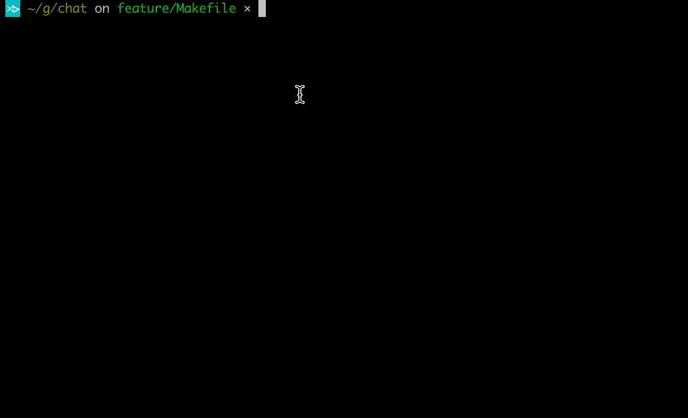

使用go语言编写的 GRPC 命令行聊天程序，包含服务端和客户端，练手之作。

redis 存储消息。   
rabbitmq 消息队列。  
支持私聊。  
支持离线消息。

1. make build  
    编译server 和client，视网络情况可能需耗费几分钟到十几分钟不等，主要耗时在基础镜像拉取。
2. make prepare  
    docker 安装redis和rabbitmq，并初始化一些配置
3. make run    
    启动服务端应用
4. make run-client  
    启动客户端应用
    
具体参考以下动图：

